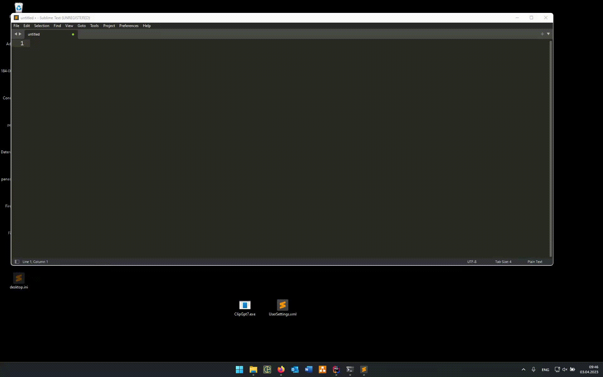

# ClipGPT

Your teacher will be clueless...

## (Anti-) Features

- **Windows only!**
- .NET 7 (C# 11) | self-contained, single-file EXE
- WinForms
- Hides as a little tray icon.
- Uses `User32.dll` functions to register a clipboard format listener.
- Sends any copied text to ChatGPT, places response back into the clipboard.

## Showcase



## Building

The application may be built as a self-contained executable, enabling it to run even on computers that do not have the
.NET 7 runtime installed.

- Install .NET 7 (Framework & Runtime)
- From the project root:

    ```bash
    dotnet publish -c Release \
                   -r win-x64 \
                   --self-contained true \
                   -p:PublishSingleFile=true \
                   -p:IncludeNativeLibrariesForSelfExtract=true \
                   -p:PublishReadyToRun=true
    ```
  
    Alternatively for Powershell:
  ```shell
  dotnet publish -c Release `
                 -r win-x64 `
                 --self-contained true `
                 -p:PublishSingleFile=true `
                 -p:IncludeNativeLibrariesForSelfExtract=true `
                 -p:PublishReadyToRun=true
  ```

The resulting binary and DLL:s are located in `ClipGpt7\bin\Release\net7.0-windows\win-x64\publish`.

## Installation

See [releases](https://github.com/cvanloo/ClipGPT/releases/latest).

## Usage

1. (If you haven't already) Create a ChatGPT account and generate an API token (https://platform.openai.com/account/api-keys).
2. Start the application `ClipGpt7.exe`
3. Locate the tray icon with the white question mark on black background.
4. Right-click → Settings
5. Paste the API token.
6. Click "Save and Close"
7. Now simply **copy** your questions, wait a bit, then **paste** GPTs answer.

## Known Problems

- The tokens in the prompt are added to the max_tokens request field. This may be no larger than 4096.
  Somehow, we need to calculate the tokens in the prompt and make sure, that we don't request a max_token larger than
  4096 - promp_tokens.
- To 'lessen' the above problem, we limit the max_tokens to 3840.
  This leaves 256 for the request. In Chat-Mode, the context is automatically cleared.
- We limit the temperature between 0-1.6, although the API would allow up to 2.
  However, anything above 1.6 seems to produce garbage.
